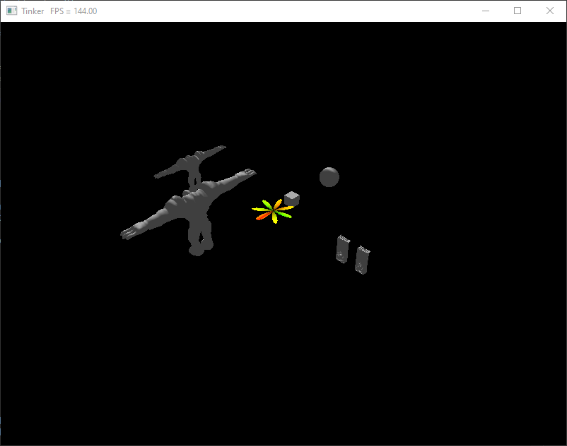
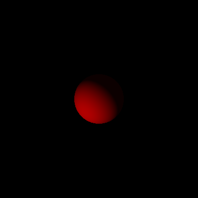
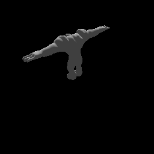

# Tinker Engine

My second game engine project. Made with things learned from Handmade Hero, coworkers, and lessons learned from the older [Joe Engine](https://github.com/klingerj/Joe-Engine). Everything written from scratch. The Joe Engine has more graphics features (for the moment), but Tinker has superior software architecture, no dependencies, compiles faster, and has other debatably cooler features and capabilities.

Currently, the project renders a few instanced models with a Z prepass (fairly barebones graphics-wise):  

Output from the SPIR-V virtual machine, evaluating a very simple Lambertian shader:  

Early in the project, I added very simple software raytracing to try to match the hardware rasterized output of the game: 
Raytraced | Rasterized  
:--------:|:----------:  
 | 

### Project hierarchy description
* <code>Assets/</code> - art files to load
* <code>Benchmark/</code> - simple setup for running benchmarked code
* <code>Core/</code> - all engine and platform code
  * <code>DataStructures/</code> - data structures, e.g. vector and hashmap
  * <code>Graphics/</code> - graphics api layer as well as backends, e.g. Vulkan
  * <code>Math/</code> - math ops, e.g. matrix multiply (SIMD-accelerated)
  * <code>Platform/</code> - platform/threading api layer as well as application main, e.g. Windows
  * <code>Raytracing/</code> - (WIP, not done!) minimal raytracing and octree code
  * <code>Utility/</code> - logging, mem alloc tracking, code block timing
* <code>Game/</code> - all game code, builds as dll
* <code>Output/</code> - dumping ground for output files, e.g. raytraced image
* <code>SPIR-V-VM/</code> - (WIP, not done!) virtual machine for evaluating SPIR-V shaders, written in pure C
* <code>Scripts/</code> - build scripts and some helpful project scripts
* <code>Shaders/</code> - shaders (GLSL) and compiled SPIR-V
* <code>Test/</code> - simple setup for running unit tests
* <code>Build/</code> - generated by the project when building

### List of features implemented currently:
* Platform layer
  * Win32
  * Automatically hotloads newly built game code dll
* API-agnostic graphics layer
  * Vulkan backend
  * Draw call batching
  * Instanced rendering
* Simple unit testing and benchmarking frameworks
* Simple linear algebra library
* Asset file loading
  * OBJ models, BMP textures
* Shader hotloading on keypress
* Shader pipeline state object permutations
* Simple thread-job system with SPSC lockless queue
* Custom memory allocators
* Memory allocation tracking
* Custom data structures
  * Vector
  * Hash map
  * Ring buffer
* SPIR-V virtual machine (WIP)
  * tested to evaluate some simple SPIR-V shaders, may become part of a full software renderer one day
* Simple CPU-side raytracing framework (Octree WIP)

### Roadmap of future features:
* Compute shader support
* Threading of file loading/parsing, streaming of models
* PBR shaders
* Virtualized textures
* Post processing
* Render graph structure
* Linux platform layer
* DX12 graphics backend
* IMGUI

### Build instructions
You will need to have installed:
* Visual Studio 2019, because the project will look for  
<code>C:\Program Files (x86)\Microsoft Visual Studio\2019\Professional\VC\Auxiliary\Build\vcvarsall.bat</code>  
(<code>Community</code> and <code>Enterprise</code> versions are also checked for)
* Vulkan SDK version 1.2.141.2 from [LunarG](https://vulkan.lunarg.com/sdk/home#windows). You currently must use this exact version, no auto-detecting occurs  

To Build:
* Run <code>proj_shell.bat</code> in the <code>Scripts/</code> directory. You can do this by double-clicking in the file explorer or from command line.
* In that shell window, run <code>ez-build_release.bat</code>. This will build every Tinker project.
You should now be able to run the game via <code>run_game.bat</code>.

### Game Demo Controls:
<code>Esc</code> - lock/unlock cursor  
<code>WASD</code> - move camera  
<code>Mouse</code> - look around  

### Platforms supported currently:
* Windows 10 / x86

### Graphics API backends supported currently:
* Vulkan

### Assets used:  
* [CGTrader - Fire Elemental by inalaatzu](https://www.cgtrader.com/free-3d-models/character/fantasy/fire-elemental-29c02a51-2d44-4c4b-9e73-fc5899cd690d)  
* [CGTrader - RTX 3090 by bemtevi3d](https://www.cgtrader.com/free-3d-models/electronics/computer/rtx-3090-graphic-card-3d-model)
